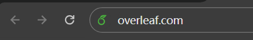
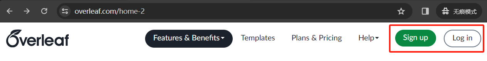
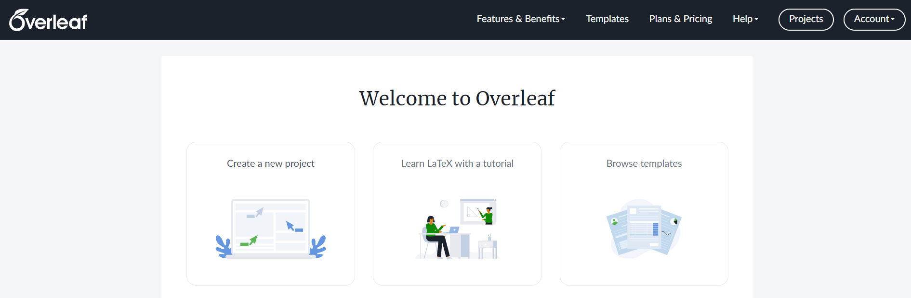
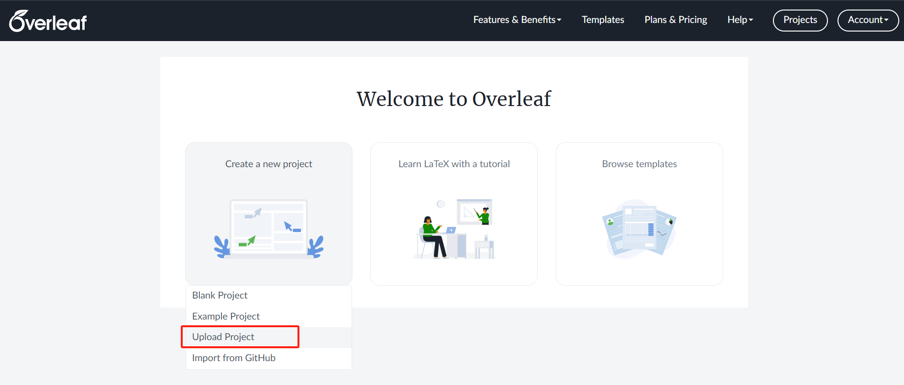
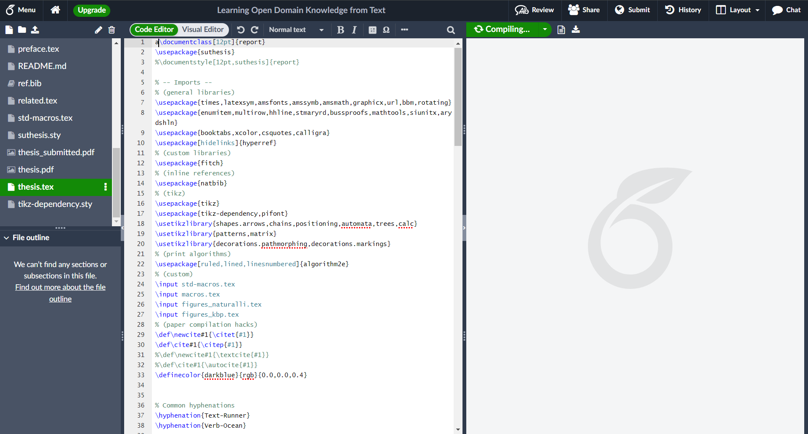
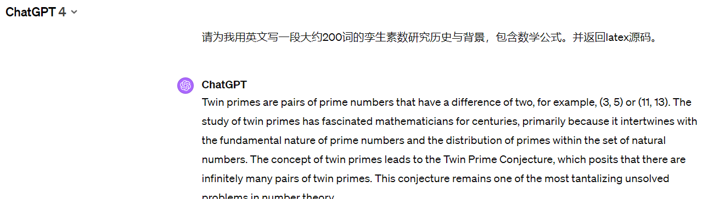
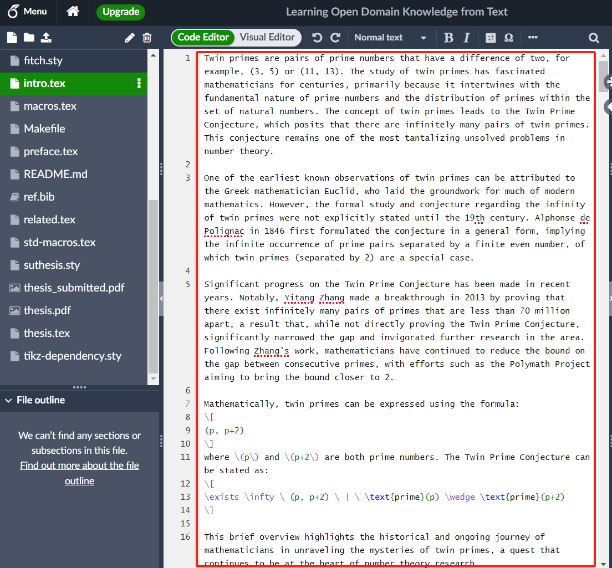
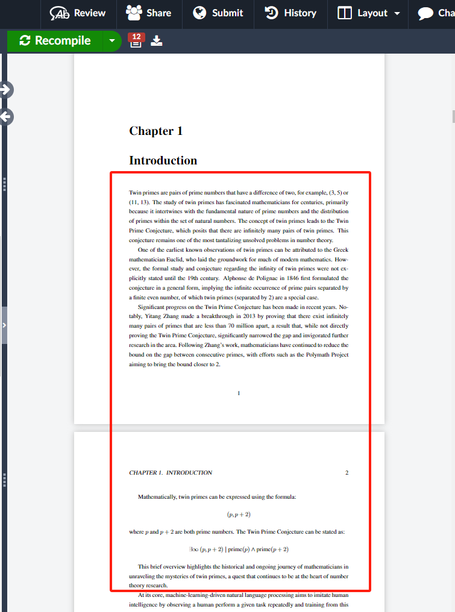

# Overleaf入门简介

overleaf是一个写论文网站，支持多人同时编辑，版本管理等。

## 一、登陆/注册页面简介
1. 首先进入浏览器，打开overleaf.com

2. 第一次进入的话，会跳转到home页面，点击sign up注册账号，注册好了后点击log in登陆。

3. 登陆之后会进入这个页面。有三个按钮，左边是创建project，中间是教程，右边是找模板

4. 如果时间充足，可以花30分钟读[中间按钮的这个教程](https://www.overleaf.com/learn/latex/Learn_LaTeX_in_30_minutes)
5. 如果想要快速开启项目，可以直接点击左边的按钮，创建一个新的project

## 二、创建project
1. 首先下载一个网上的project，比方说[博士毕业论文](https://github.com/gangeli/thesis/archive/refs/heads/master.zip)
2. 下载好了之后把得到的压缩包文件上传到overleaf。

3. 上传完毕之后会跳转到project内部，也就是我们写论文的页面

## 三、project页面介绍
页面顶部是控制台，可以共享文档，查看历史版本，修改页面布局等等。

页面左侧栏是文件管理，可以查看文件/文件夹，新建或者上传文件/文件夹。

中间是我们的论文源码(即thesis.tex文件)，右侧是我们的源码编译之后的pdf文档预览。

## 四、用ChatGPT辅助你写论文
对于初学者而言，latex源码可能并不好理解，
你可以先用chatgpt帮你写一份初稿，然后你再修改初稿里的文本部分，
比方说，我想在introduction的开头加一段带数学公式的引言：

1. 让GPT写一段介绍，并发给我latex源码

2. 找到intro.tex，把gpt写的源码添加在文件开头

3. 重新编译thesis.tex，检查introduction部分是否已添加这段话。

